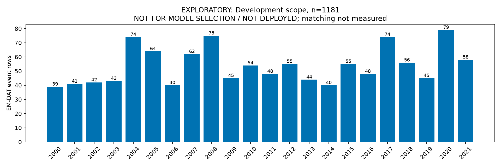

# 热带气旋外部强度数据接入可行性审计

EXPLORATORY  
NOT FOR MODEL SELECTION  
NOT DEPLOYED

## 1. 结论与完成范围

**LIMITED_FEASIBILITY / INCOMPLETE_NETWORK_BLOCKED。** 本轮已完成Development范围筛选、官方来源核对和字段时点审计；没有完成IBTrACS事件匹配及经验覆盖率统计。该分级表示此次可行性审计受限，**不是已经证明IBTrACS无法可靠匹配**。

Development 2000–2021 热带气旋事件共 **1,181条**，其中894条有死亡标签，70条为Severe；名称非空1,145/1,181（96.95%），Location非空1,133/1,181（95.94%）。匹配率和合格强度字段覆盖率均**未测量**，不能写成0%。

官方源HEAD请求返回200，但实际CSV传输中断，Python报告 `PermissionError: [Errno 13] Permission denied`。未取得完整原始数据；残留仅表头和单位行，无轨迹记录。按当前任务的网络停止条件终止，不换镜像、不继续重试、不拿残缺文件进行匹配。

因此目前**不建议申请进入正式特征增量实验**。如以后单独批准继续，只能先恢复数据审计，不能直接进入模型训练或宣称性能收益。

## 2. 隔离与数据访问

新增文件仅位于：

- `ml_experiments/exploratory/tropical_cyclone_audit/`
- `docs/exploratory/`

未修改正式modeling脚本、产物、模型Manifest、15项特征、Test报告、project-status、业务代码或部署配置。未训练模型，未读取预测文件或计算模型指标。

共享 `data/processed_hdro/disaster_hdi_merged.csv` 先检查年份字段，仅在2000–2021内提取Development所需字段；不提取Test/Maturity特征或标签。Development总数及Severe分母在此范围内计算。随后固定热带气旋ID白名单，再从原始Excel按ID提取事件名称、日期、Location、Magnitude等，白名单外事件不进入分析表。

原始Excel容器和必要ID字段扫描不等于分析其中所有事件；2024—2026 Maturity记录未被提取、保留、统计或分析。未读取Test标签、预测、概率或性能；没有进行Test覆盖率检查。

白名单SHA-256：`2cd2fb6f62a6bfd07d350183633aaa6280a6b2db58283f2d829ab364b59b6921`。

## 3. Development筛选结果

首次外部匹配前固定规则：`2000 <= year <= 2021 AND disaster_type == "Storm" AND disaster_subtype == "Tropical cyclone"`。包括无死亡标签事件，避免仅审计有标签/严重事件造成覆盖选择偏差。

- 全Development：14,348条事件，其中11,590条有标签、932条Severe。
- 热带气旋：1,181条；有标签894/1,181（75.70%），无标签287/1,181（24.30%）。
- Severe：70/1,181（5.93%），仅为覆盖描述；不用于名称、时间、区域或距离规则。
- 热带气旋涉及的Severe最多覆盖Development全部Severe中的70/932（7.51%）；这是类型范围上限，不是外部字段已覆盖数量。
- 日期粒度：day为1,172/1,181（99.24%），month为9/1,181（0.76%）；月级日期不强行补出匹配日。
- `event_id`唯一；原始Excel与处理CSV的国家、年份、主类型、子类型逐条一致。

| 年份 | 事件数 | 年份 | 事件数 |
| --- | ---: | --- | ---: |
| 2000 | 39 | 2011 | 48 |
| 2001 | 41 | 2012 | 55 |
| 2002 | 42 | 2013 | 44 |
| 2003 | 43 | 2014 | 40 |
| 2004 | 74 | 2015 | 55 |
| 2005 | 64 | 2016 | 48 |
| 2006 | 40 | 2017 | 74 |
| 2007 | 62 | 2018 | 56 |
| 2008 | 75 | 2019 | 45 |
| 2009 | 45 | 2020 | 79 |
| 2010 | 54 | 2021 | 58 |

国家/地区代码较多的有PHL 161、CHN 103、MEX 67、VNM 65、JPN 60、USA 58、TWN 46、IND 37、MDG 37。完整分布在`scope_summary.json`；保留原始代码，不默默修正诸如SPI等需要核验的代码或地区口径。

Development Storm中未自动纳入的子类型包括：Storm (General) 280、Blizzard/Winter storm 164、Lightning/Thunderstorms 163、Severe weather 153、Tornado 147、Extra-tropical storm 123、Hail 48、Sand/Dust storm 11、Derecho 4、Storm surge 3。它们在本轮筛选规则之外；不能把所有含“风暴”的记录都视为热带气旋，也不凭自由文本猜测其重新分类。

范围表含每事件ID、国家代码、名称、开始/结束日期组成字段、Location、Magnitude及量表。结束日期仅保留供可能的人工核验，未用于候选规则或特征。台风、飓风等名称表述不改变上述子类型筛选。

此图仅显示1,181条范围事件按年的计数，**不是匹配成功率或模型效果**。

## 4. 官方来源及实际下载状态

| 项目 | 记录 |
| --- | --- |
| 数据集 | International Best Track Archive for Climate Stewardship（IBTrACS） |
| 发布机构 | NOAA National Centers for Environmental Information（NCEI） |
| 版本 | v04r01 |
| 访问/下载尝试日期 | 2026-08-31 |
| 官方源文件 | `ibtracs.since1980.list.v04r01.csv` |
| HEAD状态 | 200 OK；Content-Type text/csv |
| 官方完整源大小 | 143,681,274 bytes（HEAD元数据，非完成下载量） |
| 官方Last-Modified | 2026-08-30 08:59:48 UTC |
| 官方数据总体时间范围 | 1840年代至今；该源子集为since1980 |
| 本轮拟保存范围 | 2000-01-01 ≤ ISO_TIME < 2022-01-01 |
| 实际本地文件 | `data/raw/ibtracs.v04r01.2000_2021.INCOMPLETE.csv` |
| 本地大小 | 2,942 bytes；仅表头和单位行，轨迹行0 |
| 完整下载状态 | 未完成，不可用于统计或匹配 |
| 本地SHA-256 | 见`checksums/source_manifest.json`的`sha256_partial_only`；不是完整官方文件哈希 |

官方CSV：[直接下载地址](https://www.ncei.noaa.gov/data/international-best-track-archive-for-climate-stewardship-ibtracs/v04r01/access/csv/ibtracs.since1980.list.v04r01.csv)。下载设计是保留官方表头、单位行及指定时段原始行字节；即使成功，其哈希也只代表时段子集，不能冒充完整官方文件。

已通过官方网页读取资料，但未完成离线PDF下载：

1. [NCEI产品主页](https://www.ncei.noaa.gov/products/international-best-track-archive)
2. [v04r01字段说明，2025-09-23](https://www.ncei.noaa.gov/sites/default/files/2025-09/IBTrACS_v04r01_column_documentation.pdf)
3. [v04r01技术说明，2025-04](https://www.ncei.noaa.gov/sites/default/files/2025-04/IBTrACS_version4r01_Technical_Details.pdf)
4. [官方元数据及使用约束](https://www.ncei.noaa.gov/access/metadata/landing-page/bin/iso?id=gov.noaa.ncdc%3AC01552)

使用说明可确认来源公开分发、需要按要求引用数据和论文，NOAA/NCEI不保证数据准确性、可靠性或完整性；未自行套用未经核实的CC许可证名称。文献引用：Gahtan等（2024），DOI `10.25921/82ty-9e16`；Knapp等（2010），DOI `10.1175/2009BAMS2755.1`。

## 5. 时点与泄漏审计

必须分开“记录描述的时刻”和“该数值何时发布、是否后来修订”。字段记录在登陆前，不代表当前档案中的修订值也在登陆前可得。

| 字段 | 物理/记录时点 | 本次可用性判断 |
| --- | --- | --- |
| NAME、SID、编号 | 标识事件；名称与编号可能存在机构/档案差异 | D：未证明截止时刻的发布版本；只能候选匹配使用 |
| ISO_TIME | A或B：按轨迹记录时刻与预测截点的先后决定 | UTC有效时间，不是发布时刻；as-of可用性仍D |
| BASIN、SUBBASIN | 海域分类 | 不是受影响国家或登陆国家 |
| LAT、LON | A或B：该时刻位置 | 当前版本可含修订/插值；实时可得性D |
| DIST2LAND | 当前中心到全球陆地掩膜的距离 | 不提供国家归属；小岛掩膜不完整 |
| LANDFALL | 当前到下一轨迹点之间的最近陆地距离 | 涉及后续轨迹；不能当当前时刻已知的事件国家登陆标记 |
| USA_RECORD=L | 海岸线穿越记录 | D：仍需确定国家、具体时刻及历史发布版本 |
| 登陆时间 | 需要关联事件国家、多次登陆及记录 | D：本轮未建立 |
| 登陆时最大持续风速/最低气压/等级 | 可在该时刻观测到，但目前只有档案字段定义 | D：国家登陆时间及发布来源未核验 |
| 首次进入国家附近时强度 | 需要权威几何、距离规则、时间截点 | D：未定义或计算空间距离，不猜Location坐标 |
| 各机构WIND/PRES | 某轨迹时刻的观测或估计 | 理论可属A/B；当前best-track版本的as-of状态D |
| 生命周期最大风速、最低气压 | C：完整生命周期后确定 | **POST-EVENT / NOT ELIGIBLE** |
| 最终持续时间、完整轨迹/事后影响汇总 | C | **POST-EVENT / NOT ELIGIBLE** |

A=事前或登陆时；B=过程中；C=事后；D=可获得时点不明确。混合记号表示物理观测时点可确定，但发布时点未获证据，**不是已经将其批准为A类可用字段**。

根据当前v04r01文档，`LANDFALL=0`表示到下一时步（通常3小时）之间接触陆地；不是“精确此时登陆”，也不指明哪个国家。其全球陆地掩膜只覆盖大陆及面积超过1,400 km²的岛屿，不能直接服务每个岛屿国家/地区的登陆审计。不要沿用旧版文档的6小时表述，也不要以全生涯第一次/最强登陆替代目标国家的事件。

`TRACK_TYPE=MAIN`是经过再分析的主要轨迹；PROVISIONAL仍可能被替换。技术文档说明部分位置和强度插值。因而仅有MAIN和ISO_TIME不能证明当时可得；后续若另行授权，应先寻找带发布时刻和版本记录的历史业务公告，不能通过提高模型效果来放宽此要求。

## 6. 字段口径与标准化方案审计

- 原始风速单位为knots；纯单位转换可采用 `m/s = knots × 1852 / 3600`。这不把不同平均时长变成同一物理量。本轮没有实际转换或新增统一强度列。
- USA风速为1分钟平均；NEWDELHI为3分钟；TOKYO、REUNION、BOM、NADI、WELLINGTON、HKO、KMA为10分钟；CMA为2分钟。不能遗漏CMA口径，也不能把它默认为10分钟。
- `WMO_WIND`随WMO_AGENCY变化，官方未统一调整平均时长。若以后使用，需要保留原值、机构、单位、平均时长、记录时间、转换公式及选择理由。
- 本轮未设“某机构没值就回退另一机构”的统一列。原机构列分开；缺失就保持缺失。不计算混合机构最大值。
- 气压为mb，与hPa数值一致；不得将缺失解释为0。
- 官方CSV空白代表缺失。IFLAG含O（机构原记录）、P（位置及强度等插值）、I（强度插值）、V（部分其他字段插值）等。原报告标记也不等于发布时点已验证。
- 常见机构报告为6小时，存在3小时或特殊时刻记录；合并轨迹常含3小时插值。不能把时间格点当成真实精确登陆时刻。
- 不同机构同一时点冲突的数量、差值、多次登陆的数量，本轮尚未统计。禁止以“档案里有字段”代替实际覆盖率。

上述为官方字段规范审计，不是实测数据结论。

## 7. 匹配规则草案及未执行边界

首次匹配前已保存规则文件，但由于下载中断，**匹配算法未执行、未验证**。规则不依赖Severe标记，也不读取结束日期、Test或模型输出。

- 候选时间窗：EM-DAT开始日期区间前后各3天。日级保留整日，月级保留整月不虚构日期；这是候选检索容差，不是从标签拟合的最优窗口。
- 名称：大小写、重音及描述词标准化后精确token比较；不使用单一模糊名称相似度，不自动猜测别名。
- 海域：UN子区域与可能IBTrACS basin做粗粒度一致性检查。它不足以证明轨迹影响事件所在国家。
- 未采用空间距离、外部地理编码或自由文本转坐标。现有`public/world.geo.json`缺少可核验的来源信息，未用它为HIGH提供空间证明。
- HIGH必须是唯一候选且时间、名称、区域一致，并有可靠事件国家/Location证据；仅粗海域相容不能升为HIGH。
- MEDIUM仅表示有时间/名称支持但空间证据尚未解决的唯一候选，不是正式连接。
- 多个合理SID保留AMBIGUOUS，不挑最近/最强者；唯一但证据仍不足的候选保留证据并记UNMATCHED。
- 不同国家的EM-DAT事件可指向同一SID；一个名称也可能包含多个气旋或地区别名。实际多对多数量尚未知，不作推断填数。

名称非空比例高并不能证明名称可靠、别名可自动解决或同时间同国家没有多场气旋。Location非空也不证明其粒度可靠；本轮只有可用性范围信息，未完成人工空间核验。

## 8. 所需统计的当前状态

| 项目 | 本轮结果 |
| --- | --- |
| 1. Development热带气旋总数 | 1,181 |
| 2. 年份/国家分布 | 已统计，见范围表和scope_summary.json |
| 3–6. HIGH / MEDIUM / AMBIGUOUS / UNMATCHED | 均未测量，JSON为null，不是0条 |
| 7. 唯一可靠匹配率 | 分母1,181，分子未知，比例null |
| 8–9. 各年份/国家匹配率 | 分母已固定，分子和比例未知 |
| 10. 合格登陆风速可用率 | 分母1,181，分子未知 |
| 11. 合格登陆气压可用率 | 分母1,181，分子未知 |
| 12. 合格登陆等级可用率 | 分母1,181，分子未知 |
| 13. 字段时点明确率 | 未测量；ISO_TIME不构成发布证据 |
| 14. 需人工干预事件数 | 未测量 |
| 15. 多气旋候选冲突数 | 未测量 |
| 16. 多国家事件数 | 未测量 |
| 17. 可用于未来Development CV的事件数 | 未测量，不能以894条有标签范围事件冒充合格数据 |
| 18. 潜在范围 | 热带气旋范围1,181/1,181；Severe范围70/932（7.51%）；合格字段实际覆盖未知 |

未生成假的空候选结果来暗示“全部未匹配”；`cyclone_match_candidates.csv`、`cyclone_match_audit.csv`及匹配后的processed字段表本轮均未生成。

## 9. 停止条件与建议

已经触发**网络传输失败即停止**。70% HIGH、80% HIGH+MEDIUM、60%合格强度、20%人工干预等数值条件由于没有完整数据，**不能判断是否触发**，更不能把未测量误写成0%从而宣称失败。

此外，官方文档已显示需要严肃处理国家级登陆关联、跨机构风速和as-of修订风险，但尚未量化它们在本项目中的覆盖影响。LIMITED_FEASIBILITY仅表示目前得到部分范围和规范信息，不满足进入正式模型的证据要求。

本轮不申请正式特征实验；不提出Severe指标改善结论；不启动其他灾种、人口数据、模型训练或第四阶段。以后如获批准，应先完成官方原始数据的可靠获取和版本核验，再验证匹配与发布时点，不能跳过数据审计。

## 10. 产物与验证

新增README、独立脚本、Development范围CSV、scope_summary、字段时点JSON、受限可行性JSON、规则与白名单、失败下载清单、受保护文件哈希、范围图以及验证清单。所有位置均限于两个允许目录。

脚本的scope和blocked归档流程已实际执行；`verify`重算同输入CSV/JSON并比较字节。未执行download成功路径、match流程或经验强度覆盖计算，不声称这些已通过。

核验范围ID唯一、白名单一致、年份在2000–2021、年度与国家计数合计1,181；原始匹配失败文件无轨迹行且不可用于统计；图表可以解码并已打开检查。受保护文件前后哈希比较及输出哈希见`checksums/verification.json`。

冻结推理模型SHA-256保持：`c4960347d423b1b46065c8e2fc57e1e1656fae11e1198af2fe5c6a734392a9d4`。未读取Test预测/标签，未提取Maturity，未修改正式数据、业务代码或项目状态，未提交Git。

Project status：无需更新（独立探索审计按网络停止条件归档，未改变正式状态或冻结边界）。
