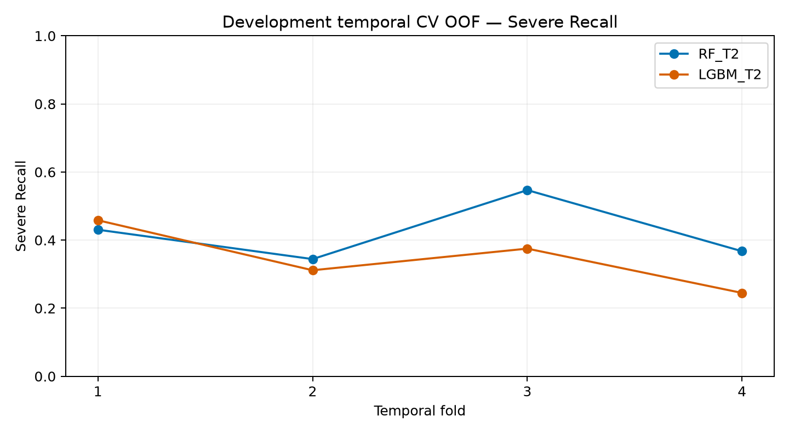
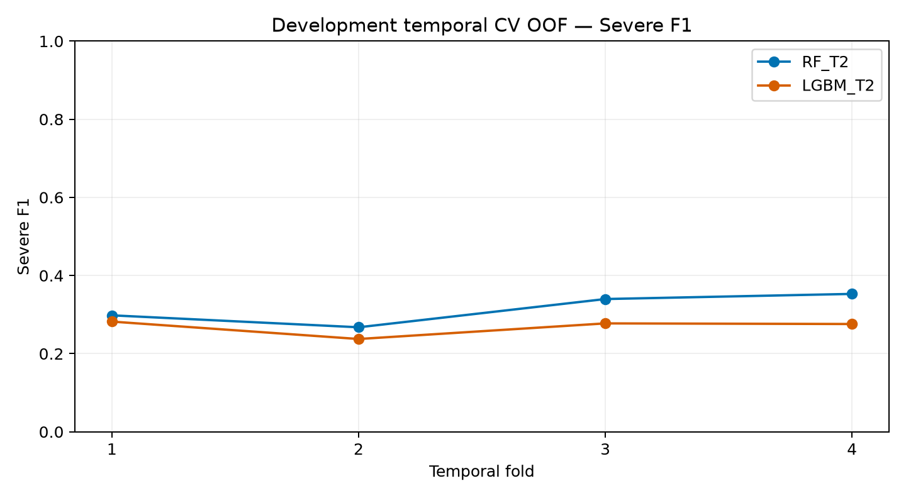
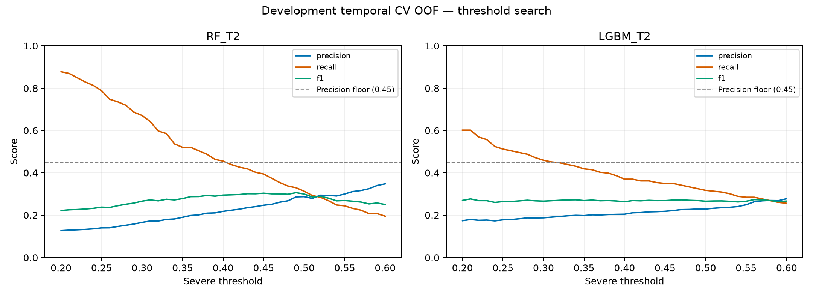
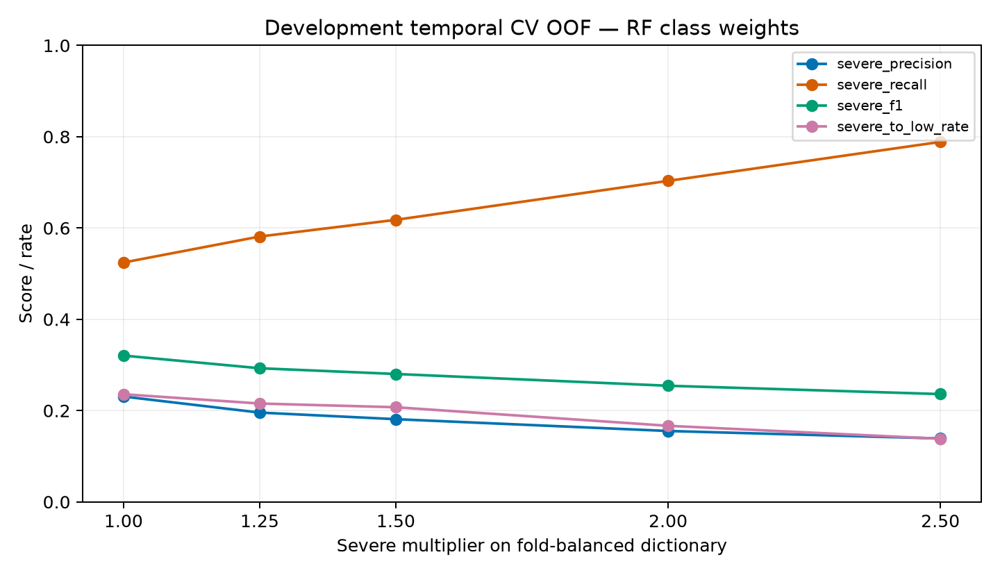
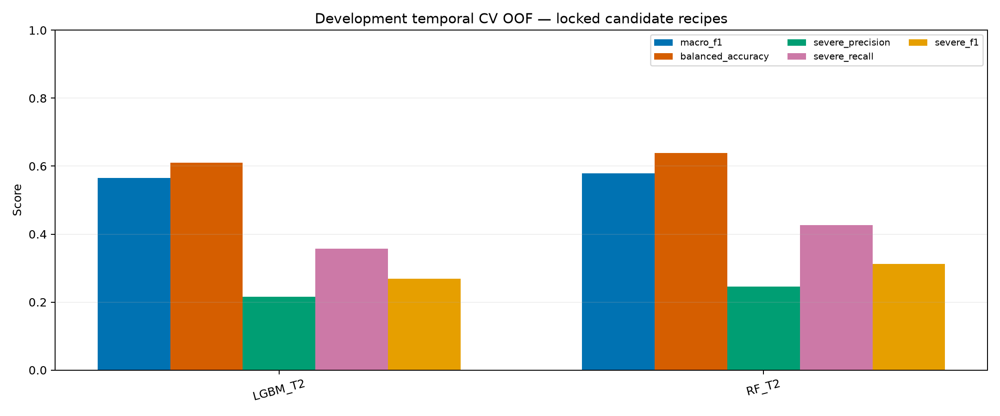
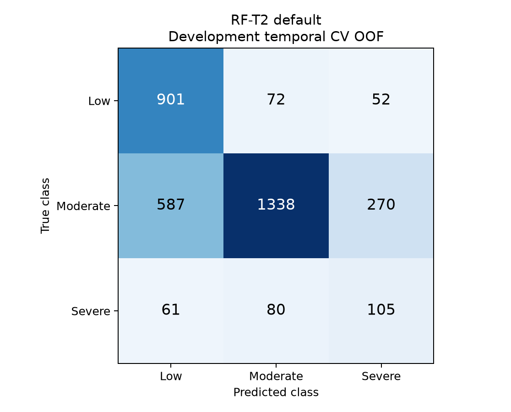
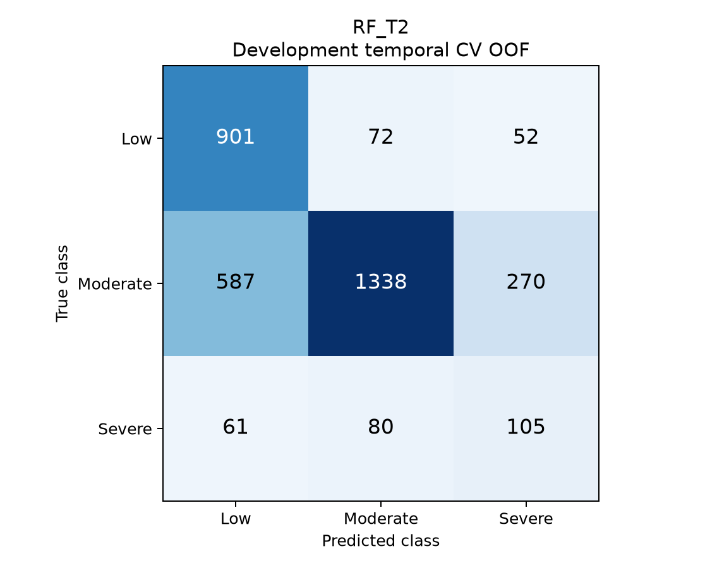

# 第三阶段第二次补充：时间交叉验证与 Severe 类别优化

## 1. 目的、边界与预注册

回应指导老师关于 Severe 指标、模型对比和时间 Cross Validation 的建议。本轮只在 Development 内研究候选，原冻结 RF-T2 不变。没有新候选的 Test 评价，没有使用 Maturity 的特征或标签，没有系统/认证/数据库/部署改动。

预设配置 SHA-256：`80df528b9ef7e79a5f6c5ae61de1ee23f80d802f525e696381e1fd860fc356f9`；随机种子 20260803。阈值网格 0.20–0.60、步长 0.01；四个 Severe 倍率 1.25/1.5/2/2.5，加固定平衡字典倍率1.0对照。配置在拟合前保存，完整尝试均归档。第四阶段仍暂停。

## 2. 数据与可行性审计

Development 有标签事件 11590 条；因果历史频率来源含无标签事件，共 14348 条。OOF 只覆盖 2014–2021 的3466条（Low 1025、Moderate 2195、Severe 246），不是全部11590条的OOF。2000–2013只作为训练起始窗口。

| year | Low | Moderate | Severe | total |
| --- | --- | --- | --- | --- |
| 2000 | 144 | 492 | 58 | 694 |
| 2001 | 105 | 439 | 61 | 605 |
| 2002 | 134 | 501 | 48 | 683 |
| 2003 | 123 | 415 | 62 | 600 |
| 2004 | 139 | 410 | 47 | 596 |
| 2005 | 152 | 485 | 62 | 699 |
| 2006 | 128 | 435 | 60 | 623 |
| 2007 | 163 | 411 | 45 | 619 |
| 2008 | 116 | 390 | 33 | 539 |
| 2009 | 102 | 355 | 47 | 504 |
| 2010 | 111 | 381 | 54 | 546 |
| 2011 | 97 | 356 | 42 | 495 |
| 2012 | 121 | 308 | 39 | 468 |
| 2013 | 126 | 299 | 28 | 453 |
| 2014 | 98 | 311 | 34 | 443 |
| 2015 | 142 | 294 | 38 | 474 |
| 2016 | 110 | 288 | 31 | 429 |
| 2017 | 120 | 280 | 30 | 430 |
| 2018 | 80 | 270 | 30 | 380 |
| 2019 | 153 | 319 | 34 | 506 |
| 2020 | 161 | 203 | 25 | 389 |
| 2021 | 161 | 230 | 24 | 415 |

### 扩展时间折

| fold | split | start | end | n | Low | Moderate | Severe |
| --- | --- | --- | --- | --- | --- | --- | --- |
| 1 | train | 2000 | 2013 | 8124 | 1761 | 5677 | 686 |
| 1 | validation | 2014 | 2015 | 917 | 240 | 605 | 72 |
| 2 | train | 2000 | 2015 | 9041 | 2001 | 6282 | 758 |
| 2 | validation | 2016 | 2017 | 859 | 230 | 568 | 61 |
| 3 | train | 2000 | 2017 | 9900 | 2231 | 6850 | 819 |
| 3 | validation | 2018 | 2019 | 886 | 233 | 589 | 64 |
| 4 | train | 2000 | 2019 | 10786 | 2464 | 7439 | 883 |
| 4 | validation | 2020 | 2021 | 804 | 322 | 433 | 49 |

四折无需调整，Severe验证数量均大于预设最少20条。每折训练年份严格早于验证年份，ID无交集，每条OOF事件只来自一个未训练过该事件的验证折。

### 时间特征与数据访问

独立计算 `upper(previous interval) < lower(current interval)` 的同国事件数，与冻结 historical_frequency 的差异为0；逐折截断未来日期后仍完全一致。不按Excel顺序累计、不让重叠年月精度事件互相提供虚构顺序。验证窗内过去已发生事件可进入后续事件的历史计数，这是顺序到达评估，不是验证窗首日对所有未来事件一次性预测。

共享CSV/XLSX文件通过年份/ID排除外期记录；物理上扫描了共享文件容器和排除字段，不声称从未触及其字节。Test/Maturity的特征与标签未进入实验数据帧或计算；模型训练只读取独立Development缓存。Test 948条的边界沿用既有冻结声明，本轮未重开Test预测表进行统计。

Magnitude沿用8个语义组，每折仅训练集拟合n/median/IQR；少于20条或IQR=0不生成z。所有15项特征均可构造，缺失按原方案处理。按折完整缺失表、统计量、类别词表和填充值已保存。

## 3. 模型与预处理口径

RF参数保持500棵树、max_depth=10、min_samples_leaf=5、max_features=0.5、balanced_subsample、random_state=20260803、n_jobs=-1。新增权重仅更改class_weight。

LightGBM复用真实历史 `LGBM-V2_P3_low_rate_balanced`：learning_rate=.03、num_leaves=63、max_depth=-1、min_child_samples=20、subsample=.8、subsample_freq=1、colsample_bytree=.7、reg_alpha=.1、reg_lambda=5。固定291轮，objective=multiclass、num_class=3，deterministic=True、force_col_wise=True。无逐折调参和early stopping。双方使用完全相同15项T2原始工程特征、折和三级评价代码。

RF为训练折拟合OneHot与中位数填补；LightGBM为训练折原生类别词表（明确UNKNOWN/MISSING）及NaN，平衡权重只从训练折类别数计算。预处理机制不同但信息范围相同。

历史LightGBM参数曾通过2020–2021 Validation选择，本轮复用它符合任务要求，但意味着这不是完全嵌套、对模型选择无偏的外层CV。历史HDI为回溯序列，也不等于具备当年发布时点的严格实时数据回测。

## 4. 默认模型逐折与OOF对比

| model_id | fold | accuracy | balanced_accuracy | macro_f1 | weighted_f1 | quadratic_weighted_kappa | severe_precision | severe_recall | severe_f1 | severe_to_low | severe_to_low_rate |
| --- | --- | --- | --- | --- | --- | --- | --- | --- | --- | --- | --- |
| LGBM_T2 | 1 | 0.6565 | 0.6263 | 0.5653 | 0.6791 | 0.4784 | 0.2037 | 0.4583 | 0.2821 | 9 | 0.1250 |
| LGBM_T2 | 2 | 0.6682 | 0.6003 | 0.5483 | 0.6851 | 0.3997 | 0.1919 | 0.3115 | 0.2375 | 25 | 0.4098 |
| LGBM_T2 | 3 | 0.6524 | 0.5985 | 0.5451 | 0.6716 | 0.3653 | 0.2202 | 0.3750 | 0.2775 | 21 | 0.3281 |
| LGBM_T2 | 4 | 0.7313 | 0.5996 | 0.5971 | 0.7270 | 0.5286 | 0.3158 | 0.2449 | 0.2759 | 13 | 0.2653 |
| RF_T2 | 1 | 0.6619 | 0.6259 | 0.5663 | 0.6804 | 0.4468 | 0.2279 | 0.4306 | 0.2981 | 11 | 0.1528 |
| RF_T2 | 2 | 0.6834 | 0.6211 | 0.5675 | 0.6979 | 0.4459 | 0.2188 | 0.3443 | 0.2675 | 17 | 0.2787 |
| RF_T2 | 3 | 0.6411 | 0.6586 | 0.5637 | 0.6611 | 0.4266 | 0.2465 | 0.5469 | 0.3398 | 16 | 0.2500 |
| RF_T2 | 4 | 0.7239 | 0.6362 | 0.6165 | 0.7210 | 0.5250 | 0.3396 | 0.3673 | 0.3529 | 17 | 0.3469 |

各折等权平均、样本标准差（ddof=1）、最小最大值：

| model_id | severe_recall_mean | severe_recall_std | severe_recall_min | severe_recall_max | severe_f1_mean | severe_f1_std | severe_f1_min | severe_f1_max | macro_f1_mean | macro_f1_std | macro_f1_min | macro_f1_max |
| --- | --- | --- | --- | --- | --- | --- | --- | --- | --- | --- | --- | --- |
| LGBM_T2 | 0.3474 | 0.0910 | 0.2449 | 0.4583 | 0.2682 | 0.0206 | 0.2375 | 0.2821 | 0.5640 | 0.0238 | 0.5451 | 0.5971 |
| RF_T2 | 0.4223 | 0.0907 | 0.3443 | 0.5469 | 0.3146 | 0.0391 | 0.2675 | 0.3529 | 0.5785 | 0.0254 | 0.5637 | 0.6165 |

全部指标的各折原值、均值、标准差、最小最大值见 `fold_metrics.csv` 和 `fold_metric_summary.csv`。合并OOF指标按事件计算，不等同于各折指标平均。

稳定性不能只看一个标准差：RF的Severe Recall均值更高，两者Recall标准差接近；LightGBM的Severe F1标准差较小，但各折F1水平均较低。这不支持“LightGBM全面优于RF”，也不应声称RF在所有稳定性指标上都更好。

## 5. 阈值实验

规则：P(Severe)≥t判Severe，否则在Low/Moderate中取较高概率。仅用OOF，在Precision≥0.45下优先Recall，再比较Severe F1、Macro F1、Severe→Low比例；并列时选择相对默认argmax改变事件数更少的阈值，最后用稳定ID排序。argmax不是固定0.5边界，故不使用距离0.5近似其偏离。

- RF_T2: 没有满足 Precision≥0.45 的阈值；不放宽底线。
- LGBM_T2: 没有满足 Precision≥0.45 的阈值；不放宽底线。

代表性阈值点（完整网格仍保留）：

| model_id | threshold | severe_precision | severe_recall | severe_f1 | severe_to_low |
| --- | --- | --- | --- | --- | --- |
| RF_T2 | 0.2000 | 0.1270 | 0.8780 | 0.2219 | 24 |
| RF_T2 | 0.4000 | 0.2179 | 0.4553 | 0.2947 | 63 |
| RF_T2 | 0.6000 | 0.3478 | 0.1951 | 0.2500 | 76 |
| LGBM_T2 | 0.2000 | 0.1737 | 0.6016 | 0.2696 | 40 |
| LGBM_T2 | 0.4000 | 0.2045 | 0.3699 | 0.2634 | 67 |
| LGBM_T2 | 0.6000 | 0.2775 | 0.2561 | 0.2664 | 71 |

预定范围内最高Severe Precision：RF 0.3478；LightGBM 0.2775。这些最大值也不能替代联合约束下的候选选择，不扩展范围追加搜索。

0.45底线是实验中限制误报的预设要求，不是已获得专业认可的业务风险标准；仍可能有超过半数Severe预测为误报。所有41个阈值、两个模型、各折及合并OOF结果共410行全部保存。未校准输出概率不当作真实发生概率。

## 6. 类别权重与组合

scikit-learn 1.9.0中，balanced_subsample在每棵树抽样后平衡；固定字典按折训练N/(3*n_c)再乘Severe倍率。该版本sample/class weights参与bootstrap抽样，不能将固定字典倍率称为逐树balanced_subsample的精确相乘。倍率1.0对照用于分开解释机制变化与倍率变化。

| model_id | multiplier | severe_precision | severe_recall | severe_f1 | macro_f1 | balanced_accuracy | severe_to_low | eligible_for_retention |
| --- | --- | --- | --- | --- | --- | --- | --- | --- |
| RF_weight_1 | 1.0000 | 0.2308 | 0.5244 | 0.3205 | 0.5741 | 0.6561 | 58 | False |
| RF_weight_1.25 | 1.2500 | 0.1956 | 0.5813 | 0.2927 | 0.5549 | 0.6561 | 53 | False |
| RF_weight_1.5 | 1.5000 | 0.1812 | 0.6179 | 0.2802 | 0.5410 | 0.6543 | 51 | False |
| RF_weight_2 | 2.0000 | 0.1553 | 0.7033 | 0.2544 | 0.5059 | 0.6461 | 41 | False |
| RF_weight_2.5 | 2.5000 | 0.1389 | 0.7886 | 0.2362 | 0.4698 | 0.6370 | 34 | False |

没有权重候选同时达到 Precision≥0.45 且 Severe F1 严格优于原基准，因此不保留优化权重及其组合；不降低底线、不搜索额外倍率。

## 7. 开发阶段候选锁定

| candidate_id | accuracy | balanced_accuracy | macro_f1 | weighted_f1 | severe_precision | severe_recall | severe_f1 | severe_to_low | severe_to_low_rate |
| --- | --- | --- | --- | --- | --- | --- | --- | --- | --- |
| LGBM_T2 | 0.6757 | 0.6097 | 0.5654 | 0.6891 | 0.2157 | 0.3577 | 0.2691 | 68 | 0.2764 |
| RF_T2 | 0.6763 | 0.6385 | 0.5794 | 0.6891 | 0.2459 | 0.4268 | 0.3120 | 61 | 0.2480 |

按预定规则，推荐开发候选为 **RF_T2**。相对RF-T2，OOF Severe Recall变化+0.0000、Severe F1变化+0.0000、Macro F1变化+0.0000、Severe→Low数量变化+0。本次约束下未选出足以优先于默认 RF-T2 的候选；继续保留基准，不用 Test 反复寻找改善。

此处阈值/权重选择和汇报使用同一OOF，存在选择乐观偏差，不是新的独立泛化结论。锁定时间：2026-08-31T07:20:34.133447+00:00。仅锁定实验配方，未在全Development重拟合、未替换生产模型。是否进行一次性Test评估由用户另行批准。

## 8. 论文图表

以下全部是 **Development 时间CV OOF**，不是Test。纵轴从0开始，比例图统一0–1；使用色觉缺陷相对友好的颜色。PNG及底层数据均归档。

各折RF与LightGBM Severe Recall。

各折Severe F1。

阈值与Precision/Recall/F1。

权重倍率与Severe指标。

主要候选综合指标。

RF-T2默认OOF混淆矩阵。

推荐Development候选OOF混淆矩阵。

## 9. 时间序列问题边界与局限

year/event_month是给定灾害事件的分类输入，时间CV用于防止未来事件进入过去训练；模型不预测灾害是否发生。未来灾害次数或发生概率趋势是不同任务，需与指导老师另行确认。本轮没有ARIMA、Prophet、LSTM、SMOTE、两阶段模型或概率校准。

Severe每折仅49–72条，单个事件即可明显改变指标；不以细微差异声称显著优越。折之间训练集重叠、国家与时间相关，标准差只是描述量。OOF类别比例与未来年份未必相同。权重与阈值提高召回可能以误报和其他类别F1为代价；需结合完整混淆矩阵解释。

## 10. 复现与冻结边界

两次独立完整CV拟合（各28个模型拟合）结果一致：预测类别完全相同，概率最大绝对差3.33e-16，指标差在1e-15内；特征顺序、类别词表、Magnitude统计量相同。第4折RF默认预测与原T2历史Validation类别完全相同，概率最大误差3.33e-16。配置、代码、结果与原始输入哈希归档。

冻结原模型及API副本SHA-256均为 `c4960347d423b1b46065c8e2fc57e1e1656fae11e1198af2fe5c6a734392a9d4`；受保护文件99个前后不变。Test未用于任何新候选评价/选择；Maturity特征标签未使用。项目状态仍为实验评估，正式Frozen边界不变，不更新project-status。

## 11. 可直接发给指导老师的说明

本次采用四折扩展窗口时间交叉验证，在2000–2021年Development内比较原生三级Random Forest和LightGBM，并预设Severe阈值与类别权重候选。基准RF-T2的OOF Severe Recall为0.4268、F1为0.3120、Macro F1为0.5794。本轮没有新增优化方案满足预设Precision约束，因此保留RF-T2默认基准，而非宣称优化成功。提高Severe权重虽增加Recall，但Precision和F1下降。这些是Development实验结果，尚未进行新候选Test评价；最终RF-T2保持冻结。

默认基准的保留不表示它达到0.45底线；该底线用于接受新增优化候选。当前不建议为寻找改善直接推进Test。如果论文需要原生三级LightGBM的最终独立对照，应另行批准一次性评价，不进行测试后调参。

## 12. 补充执行验证

- 实验不变量单元测试：7项通过。
- 原模型API测试：32项通过；Python 3.14报告两条HTTPError资源自动回收ResourceWarning，不影响断言结果，未为此修改API或测试逻辑。
- 七张PNG均已打开检查，标题、坐标和混淆矩阵可读。因没有可行优化候选，推荐候选矩阵与RF默认矩阵相同，特意保留并明确标记，不伪造改善。
- CSV重新读取、完整尝试数量、配置和产物SHA-256清单在收尾验证中核对。
