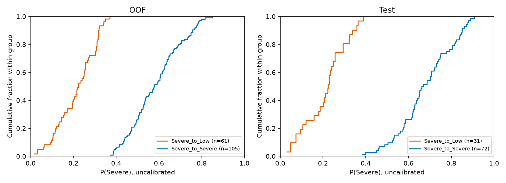
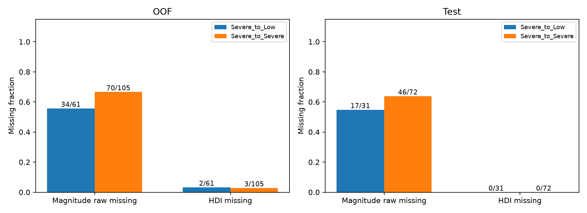
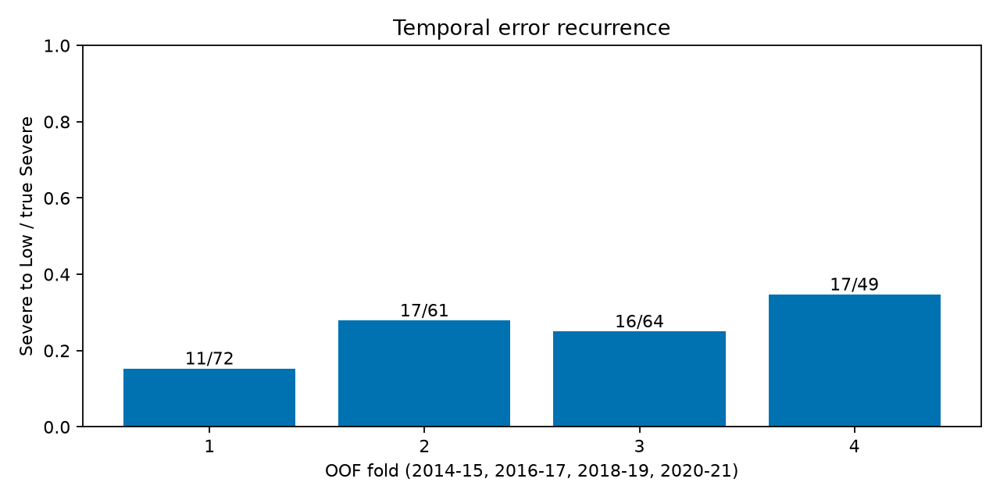
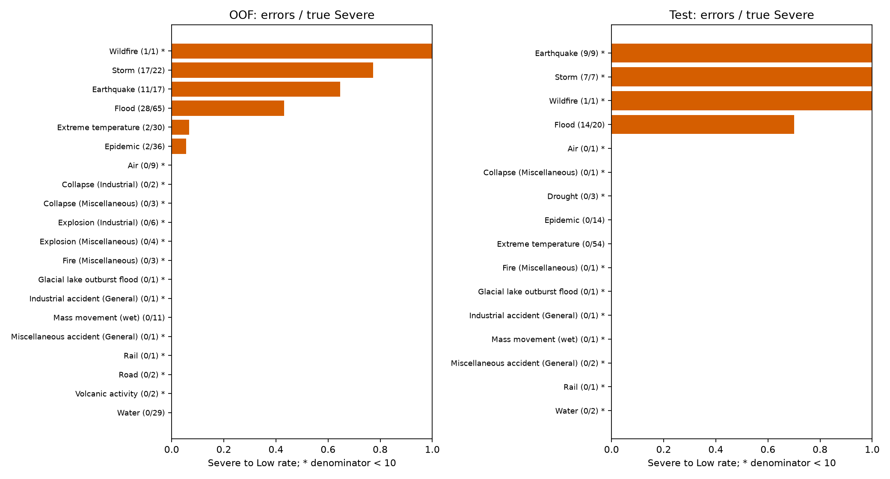

# 第三阶段补充三：Severe严重漏判错误画像与数据缺口诊断

## 1. 结论先行与证据边界

本轮为既有 RF-T2 结果的描述性诊断，不是新模型实验。主要证据来自 Development 时间 OOF，Test 仅用于补充检查，不混合计算。

最重要的三个发现：

1. **漏判主要集中于洪水、风暴和地震，且三类均在四折重复出现。** OOF 中三类共占 56/61（91.80%）的 Severe→Low；其中风暴 17/22 个真实 Severe 被判 Low，且正确 Severe 为 0/22。这不是单一 Test 年份才出现的问题。
2. **不能把漏判简单归因于 Magnitude 或 HDI 缺失。** OOF 漏判组 Magnitude 原值缺失 34/61（55.74%），正确 Severe 组反而为 70/105（66.67%）；HDI 缺失仅 2/61 对 3/105。地震漏判 11/11 均有 Magnitude。数据覆盖不足确实存在，但不等于已经证明缺失造成错误。
3. **Location 非空不等于可以直接接入人口栅格。** OOF 漏判组 58/61 有文本，但 55/61 含多地点或层级分隔标记；文本主要需要清洗、行政区消歧及空间范围确认。低成本尝试宜先聚焦单一灾种和少量事前可得信息，不宜立即开展全量地理编码与栅格连接。

概率画像属于**混合型、整体偏弱 Severe 信号**：OOF 漏判 P(Severe) 中位数 0.2221，Low−Severe 概率差中位数 0.3082。存在接近边界的个案，也存在很低的 Severe 输出，但不能说全部都只是差一点，或全部都几乎没有信号。概率本身不能证明信息缺失的因果机制。

## 2. 数据来源、白名单与冻结保护

共享原始数据容器仅用于按event_id白名单提取OOF/Test所需字段，2024—2026年Maturity记录未被提取、保留、统计或分析。

- 先读取既有 `reports/time_cv_oof_predictions.csv`，仅选择 `RF_T2`；另读取 `three_class/final_t2/predictions/test_predictions.csv`。
- 在打开共享容器前，保存排序后的 4,414 条事件白名单：OOF 3,466 条、Test 948 条；包含 dataset、event_id、year、fold。
- 白名单 CSV SHA-256：`6186bef76847003754ce73c7f251988e02e94966c20de60c055216ab5cbf014b`。
- 共享来源为 `data/processed_hdro/disaster_hdi_merged.csv` 和 `data/emdat_raw.xlsx`。不是另一个 `data/processed/` 同名旧版本。
- CSV 逐行先判断 ID，再保留最小字段；Excel 先解析表头及 ID，再对已命中事件解析所需字段。未运行旧的全量加载、统计或训练脚本。
- `total_deaths` 仅对白名单事件读取，用来验证现有标签与冻结的 0–9 / 10–99 / ≥100 定义一致；不进入导出事件表，也不是新增特征。
- 检查共享来源与预测年份一致、Excel 与 CSV 灾种一致；OOF 还与独立 Development 缓存逐字段核对。不存在重复匹配、缺失 ID、标签或字段冲突。
- 月份只按既有日期粒度规则恢复；Magnitude z 只用已归档的各折训练统计或最终 Development 统计，仍按原规则截断至 [-5,5]。不拟合统计量、不改预处理、不加载模型进行新预测。
- 两份冻结模型（最终产物及推理副本）SHA-256 均保持：`c4960347d423b1b46065c8e2fc57e1e1656fae11e1198af2fe5c6a734392a9d4`。

OOF 不是冻结最终模型对训练数据的拟合预测，而是同一固定 RF-T2 配方的既有时间折留出预测；它覆盖 2014–2021，不覆盖所有 Development 年份。OOF 与 Test 的训练窗口不同，不能把两者指标差直接理解为模型优化收益。

## 3. 样本与预测一致性

类别顺序始终为 Low、Moderate、Severe。每个数据集内每个事件仅一条预测，三个概率有限、位于 [0,1]、和为 1，预测类别与 argmax 一致。

| 集合 | 年份 | Low | Moderate | Severe | 总数 | Severe→Low | Severe→Moderate | Severe→Severe |
| --- | --- | ---: | ---: | ---: | ---: | ---: | ---: | ---: |
| OOF 折1 | 2014–2015 | 240 | 605 | 72 | 917 | 11 | 30 | 31 |
| OOF 折2 | 2016–2017 | 230 | 568 | 61 | 859 | 17 | 23 | 21 |
| OOF 折3 | 2018–2019 | 233 | 589 | 64 | 886 | 16 | 13 | 35 |
| OOF 折4 | 2020–2021 | 322 | 433 | 49 | 804 | 17 | 14 | 18 |
| OOF 合计 | 2014–2021 | 1025 | 2195 | 246 | 3466 | 61 | 80 | 105 |
| Test | 2022–2023 | 305 | 524 | 119 | 948 | 31 | 16 | 72 |

Moderate→Low 对照组分别为 OOF 587/2,195、Test 147/524。JSON 为所有组提供独立统计，还包括全部真实 Severe 和全部事件。

混淆矩阵（行=真实，列=预测）：

```text
OOF                       Test
              L    M   S                L    M   S
Low         901   72  52   Low         277   14  14
Moderate    587 1338 270   Moderate    147  329  48
Severe       61   80 105   Severe       31   16  72
```

OOF 总体及逐折矩阵与既有 `run1/confusion_matrices.json` 一致；Test 矩阵与冻结报告完全一致。

## 4. Development OOF 主要错误画像

### 4.1 灾种、子类型与地域

“漏判率”的分母是该类型全部真实 Severe；“错误占比”的分母为全部 61 条 Severe→Low。真实 Severe 分母少于 10 标为小样本，仅描述；分母达到 10 也不代表已经充分稳定。

| 灾种 | 漏判/真实Severe | 漏判率 | 占全部错误 | 正确Severe |
| --- | ---: | ---: | ---: | ---: |
| Flood | 28/65 | 43.08% | 28/61（45.90%） | 22 |
| Storm | 17/22 | 77.27% | 17/61（27.87%） | 0 |
| Earthquake | 11/17 | 64.71% | 11/61（18.03%） | 6 |
| Epidemic | 2/36 | 5.56% | 2/61（3.28%） | 34 |
| Extreme temperature | 2/30 | 6.67% | 2/61（3.28%） | 28 |
| Wildfire（小样本） | 1/1 | 100% | 1/61（1.64%） | 0 |

Flood + Storm 占 45/61（73.77%），兼有数量和跨折证据，适合作为后续可行性审计的优先范围。Wildfire 的 1/1 不构成优先投入依据。没有 Severe→Low 的类型也可能存在 Severe→Moderate，不能等同于识别良好。

子类型中 Tropical cyclone 为 14/16，Ground movement 为 11/16；Flood (General) 为 19/43，Flash flood 5/12，Riverine flood 4/10。由此风暴的优先范围可缩小至热带气旋，但目前没有验证任何外部数据源的实际可连接率或预测收益。

地域例：South-eastern Asia 15/30、Eastern Asia 10/20、Latin America and the Caribbean 10/21、Sub-Saharan Africa 13/56；Southern Asia 为 3/66。国家例：CHN 7/12、IDN 6/13、NGA 3/11；PHL 4/8 属小样本。它们受到灾种组成影响，不支持按国家建立“高漏判风险规则”。完整国家、区域、年份、月份、子类型、日期粒度、Magnitude group 列表包含零错误组，见 JSON `categories`；未仅按错误数量筛选输出。

### 4.2 概率与边界距离

| 组 | n | P(Severe)最小 | Q1 | 中位数 | Q3 | 最大 | 均值 |
| --- | ---: | ---: | ---: | ---: | ---: | ---: | ---: |
| OOF Severe→Low | 61 | .0170 | .1444 | .2221 | .3035 | .3705 | .2141 |
| OOF Severe→Severe | 105 | .3733 | .4947 | .5787 | .6675 | .8499 | .5844 |
| Test Severe→Low | 31 | .0317 | .1389 | .2232 | .2753 | .3896 | .2115 |
| Test Severe→Severe | 72 | .3837 | .5860 | .6650 | .7815 | .9071 | .6785 |

| P(Severe)区间 | OOF漏判（分母61） | OOF正确（105） | Test漏判（31） | Test正确（72） |
| --- | ---: | ---: | ---: | ---: |
| [0,.10) | 7（11.48%） | 0（0%） | 6（19.35%） | 0（0%） |
| [.10,.20) | 17（27.87%） | 0（0%） | 5（16.13%） | 0（0%） |
| [.20,.30) | 20（32.79%） | 0（0%） | 14（45.16%） | 0（0%） |
| [.30,.40) | 17（27.87%） | 6（5.71%） | 6（19.35%） | 2（2.78%） |
| [.40,1] | 0（0%） | 99（94.29%） | 0（0%） | 70（97.22%） |

OOF 漏判的 P(Low)/P(Moderate) 均值为 .5517/.2342；正确 Severe 为 .1562/.2594。漏判最大概率就是 P(Low)，中位数 .5412。Low−Severe 差最小 .0113、Q1 .1848、中位数 .3082、Q3 .4625；Moderate−Severe 差中位数 .0019。这说明主要竞争来自 Low，而不是与 Moderate 相近就可以称为接近最终决策边界。

仅 7/61 的 P(Severe)<.10，不能把全部漏判称作“完全没有信号”；但多数 Low−Severe 差也并不微小，不支持“只调整一点阈值就能解决”。这是混合型输出画像，不是以概率确定缺失信息的诊断标签。正确/错误组按预测定义分组，概率分离部分是定义导致的，不能当作独立模型解释或因果证据。本轮不选择新阈值，未校准概率也不等于真实死亡等级概率。



### 4.3 缺失率与类型混杂

| OOF字段/标记 | 漏判（61） | 正确Severe（105） | 全部Severe（246） | 全部事件（3466） | 漏判−正确，百分点 |
| --- | ---: | ---: | ---: | ---: | ---: |
| Magnitude原值缺失 | 34/61 | 70/105 | 177/246 | 2872/3466 | −10.93 |
| Magnitude z缺失 | 34/61 | 72/105 | 179/246 | 2877/3466 | −12.83 |
| Magnitude group未知/不可用 | 2/61 | 49/105 | 111/246 | 1580/3466 | −43.39 |
| HDI缺失 | 2/61 | 3/105 | 7/246 | 62/3466 | +0.42 |
| 月份缺失 | 1/61 | 0/105 | 1/246 | 9/3466 | +1.64 |
| 日期插补/非day | 5/61 | 22/105 | 28/246 | 114/3466 | −12.76 |
| 子类型宽泛标记 | 19/61 | 30/105 | 106/246 | 1899/3466 | +2.58 |

`hdi_missing` 与 HDI null、`month_missing` 与月份 null 分别一致；Magnitude 原始缺失与 z 缺失不是同一概念，不合并。group_unknown 包括组未通过原有样本量/IQR资格规则，不表示所有相应原值都缺失。子类型“宽泛”操作定义为与主类型相同或含 General，仅为文本代理指标；不能认为所有同名子类型都无效。

日期粒度缺失、子类型空缺、国家格式异常/显式未知、区域空白/显式未知，在 OOF 全部事件中各为 0/3,466，在 Test 各为 0/948。国家检查仅覆盖三位大写格式及 UNK/XXX，区域检查仅覆盖空白/未知标记，**不等于已完成完整 ISO/地域语义验证**。

类型内比较避免把灾种构成误作缺失效应：

- OOF 洪水：Magnitude 缺失 Severe 的漏判率 20/46（43.48%），有值 Severe 为 8/19（42.11%），差仅 +1.37 个百分点；漏判与正确组的原始缺失率为 20/28 对 15/22。不能据此断言补齐原有面积值就会减少漏判。
- OOF 风暴：缺失者 9/11 漏判，有值者 8/11 漏判，两类都高；正确 Severe 组为空，相关对照统计为 null，不伪造 0% 缺失率。
- OOF 地震：11/11 漏判和 6/6 正确 Severe 均有 Magnitude。漏判的组内 z 中位数 .3846，正确组 .8462，但正确组只有 6 条，且 z 不是地点级破坏或暴露信息。
- OOF 极端温度：只有 2 个漏判，均缺失 Magnitude；不能用这 2 条覆盖整体结论。

因此“数据缺失普遍存在”有证据，“缺失就是严重漏判主因”没有一致证据。完整缺失率及相对正确组、全 Severe、全事件的百分点差均在 JSON 中；灾种内分层见 `severe_underprediction_stratified.json`。



### 4.4 连续特征和月份

下表每项为“漏判 / 正确Severe”；标准差采用 ddof=1。δ 为 Cliff's delta，正值表示漏判组观测值倾向更高，仅对非缺失值计算，不做 p 值筛选。

| OOF变量 | 有效n | 均值 | Q1 | 中位数 | Q3 | 标准差 | 缺失率 | δ |
| --- | --- | --- | --- | --- | --- | --- | --- | ---: |
| year | 61/105 | 2017.689/2017.324 | 2016/2015 | 2018/2018 | 2020/2019 | 2.157/2.251 | 0/61；0/105 | .094 |
| historical_frequency | 61/105 | 290.246/200.581 | 70/56 | 151/119 | 385/270 | 344.481/195.511 | 0/61；0/105 | .116 |
| hdi | 59/102 | .6816/.6622 | .5570/.5320 | .7070/.6335 | .7760/.7423 | .1354/.1616 | 2/61；3/105 | .106 |
| magnitude_robust_z | 27/33 | .7976/.4770 | −.1303/−.2857 | .3846/.5714 | 1.0325/.8656 | 1.4416/1.2569 | 34/61；72/105 | .065 |

各项 pooled 效应均不大，不能从这些比较断言某字段没有价值。不同灾种的 z 是不同物理量经组内标准化后混合，绝不能当作统一致灾强度；存在截断、缺失选择及各折基准不同。

月份只作圆周描述：OOF 漏判有效 60/61，正确组 105/105；圆周合成向量长度分别 .1569、.1722，未显示强单一月份集中。完整 12 个月计数、sin/cos 均值在 JSON，不采用“月份越大风险越高”的线性解释。

### 4.5 时间稳定性

| OOF折 | TP/真实Severe | TP/预测Severe | Recall | Precision | F1 | F2 | Severe→Low/真实Severe |
| --- | ---: | ---: | ---: | ---: | ---: | ---: | ---: |
| 1 | 31/72 | 31/136 | .4306 | .2279 | .2981 | .3656 | 11/72（15.28%） |
| 2 | 21/61 | 21/96 | .3443 | .2188 | .2675 | .3088 | 17/61（27.87%） |
| 3 | 35/64 | 35/142 | .5469 | .2465 | .3398 | .4397 | 16/64（25.00%） |
| 4 | 18/49 | 18/53 | .3673 | .3396 | .3529 | .3614 | 17/49（34.69%） |

F1=2TP/(真实Severe+预测Severe)，F2=5TP/(4×真实Severe+预测Severe)。

| 类型或缺失标记 | 折1 | 折2 | 折3 | 折4 |
| --- | ---: | ---: | ---: | ---: |
| 洪水漏判/该类真实Severe | 5/13 | 7/20 | 8/13 | 8/19 |
| 风暴漏判/该类真实Severe | 2/3* | 4/5* | 4/5* | 7/9* |
| 地震漏判/该类真实Severe | 1/5* | 6/6* | 2/3* | 2/3* |
| 漏判组Magnitude缺失 | 6/11 | 8/17 | 10/16 | 10/17 |
| 正确组Magnitude缺失 | 16/31 | 18/21 | 21/35 | 15/18 |
| 漏判组HDI缺失 | 0/11 | 2/17 | 0/16 | 0/17 |
| 正确组HDI缺失 | 0/31 | 2/21 | 1/35 | 0/18 |

星号为类型分母<10。三类均跨四折出现，但地震 6/11 个错误来自第二折，波动较大；风暴逐折样本小，不能精确外推其未来漏判率。Magnitude 缺失差在折间方向不一致；HDI 缺失并非跨折持续解释。折4高于折1不是单调恶化的充分证据。



## 5. Test 的31条补充画像

此处描述冻结 Test，不创造新选模规则。

- 洪水 14/20（70.00%），占错误 14/31；地震 9/9、风暴 7/7、野火 1/1，占错误分别 9/31、7/31、1/31。后三类分母<10，100%不应被外推。
- OOF 识别出的三大灾种在 Test 占 30/31（96.77%），重复方向明确，但比例不是稳定参数。
- Test 漏判 P(Severe) 中位数 .2232、Low−Severe 中位数 .2982，与 OOF 的弱信号/混合画像相近。P(Low)/P(Moderate) 均值 .5620/.2265；正确 Severe 为 .1947/.1268。完整同口径统计见 JSON。
- Magnitude 原值缺失 17/31（54.84%），正确组 46/72（63.89%），差 −9.05 个百分点；两组 HDI 均无缺失（0/31、0/72）。全部真实 Severe Magnitude 缺失 79/119，全部事件 810/948；z 缺失为 79/119、811/948。不能从总体差归因。
- Test 洪水全部 20/20 个真实 Severe、全部 242/242 条洪水记录 Magnitude 都缺失，因而没有 Test 洪水内部“有值 vs 无值”的对照。该现象是本段补充观察，不能倒过来作为选择新特征的唯一理由。
- 地震漏判 9/9 均有 Magnitude，再次说明“有震级”不等于足够识别死亡等级。

| Test变量 | 有效n：漏判/正确 | 均值 | Q1 | 中位数 | Q3 | 标准差 | 缺失：漏判/正确 | δ |
| --- | --- | --- | --- | --- | --- | --- | --- | ---: |
| year | 31/72 | 2022.548/2022.500 | 2022/2022 | 2023/2022.5 | 2023/2023 | .506/.504 | 0/31；0/72 | .048 |
| historical_frequency | 31/72 | 302.742/98.500 | 94/29.75 | 193/53 | 413/95 | 319.262/142.584 | 0/31；0/72 | .654 |
| hdi | 31/72 | .6398/.8184 | .5165/.7668 | .6220/.8885 | .7315/.9185 | .1450/.1525 | 0/31；0/72 | −.597 |
| magnitude_robust_z | 14/26 | .0789/−.2957 | −.6458/−.4949 | −.3333/−.3661 | .9271/−.0508 | .9065/.4808 | 17/31；46/72 | .121 |

## 6. 共同规律与不能视为稳定的Test现象

共同：洪水/风暴/地震集中；漏判组 Severe 概率偏弱；Magnitude 缺失总体上不高于正确组；HDI 缺失不是主要解释；Location 文本普遍非空但空间表述复杂。

仅 Test 明显或方向不一致的现象：

- Test 漏判组 HDI 更低（δ=−.597），OOF 反而略高（δ=.106）；不能把“低HDI导致漏判”写成稳定规律。
- Test 历史频率差明显（δ=.654），OOF 仅 .116；可能与国家/类型构成有关，不能据此新增时间规则。
- Test 正确 Severe 中极端温度占 54/72，而 OOF 为 28/105。Test 正确组的 HDI、日期粒度、Location 空缺及月份集中都可能受此构成影响，尚非因果分解。
- Test 正确组月份圆周集中度 .6655（有效70/72），OOF .1722（105/105）；不能推广为普遍季节规律。
- Test 地震/风暴100%漏判及洪水Magnitude全空，属于特定小样本或时间段的补充观察，不用于调参或证明新特征有效。



## 7. Location字段可用性审计

只检查已有文本，不外部地理编码，不猜坐标。逗号/分号/斜线/and 是“多地点或层级描述标记”，不是确认独立地点个数；行政层级字符串也可能包含逗号。宽泛标记包括全国、跨地区、省区复数、流域和海岸等英文词形，不是完整地名识别器。

| 组 | 非空/总数 | 非空唯一值 | 长度Q1/中位数/Q3 | 多地点/层级标记 | 宽泛标记 |
| --- | ---: | ---: | --- | ---: | ---: |
| OOF漏判 | 58/61（95.08%） | 58 | 59/89.5/160.75 | 55/61 | 23/61 |
| OOF正确Severe | 81/105（77.14%） | 81 | 39/79/158 | 68/105 | 28/105 |
| Test漏判 | 31/31（100%） | 31 | 47/83/126 | 29/31 | 9/31 |
| Test正确Severe | 24/72（33.33%） | 24 | 41.5/58.5/124.25 | 22/72 | 3/72 |

非空率差：OOF +17.94 个百分点，Test +66.67 个百分点。漏判并不是集中于没有 Location 的事件。全事件 OOF 非空 3,291/3,466、唯一值3,154；Test非空810/948、唯一值799。其非空长度中位数均为37字符；完整最小/最大、均值、标准差及所有对照组统计在 JSON。

代表性原文片段（均来自白名单，不作坐标推断）：

- `Alta Verapaz,Petén, Quiché, Sololá, Izabal...`：逗号后的空格不一致，多行政区串联。
- `Amatrice, Accumoli, Pescara del Tronto, Arquataa, Posta (Rieti and Ascoli Piceno provinces)`：地点与省级层次混合，词形需要后续权威地名核验，不能直接猜测纠正。
- `Ancash department (Huarmey, Casma, El Santa provinces); Tumbes department...`：括号嵌套及分号层级混用。
- Test 原文含 `Zomba City, Zomb, Mwanza Distriicts`：可见不一致/疑似拼写问题，本轮仅记录，不修改或自动消歧。

三级可用性判断：

1. **可直接地理编码：本轮没有确认任何记录达到这一标准。** OOF漏判仅2/61、Test漏判2/31没有被多地点/宽泛规则标记，只能称为单一描述候选，不能把未匹配标记等同于地理编码成功。
2. **需要大量清洗后可能使用：** OOF漏判56/61、Test漏判29/31落入多地点或宽泛规则的并集；需保留国家上下文、行政层级和多区域覆盖，不应简单取一个点。
3. **当前不适合位置级连接：** OOF漏判3/61为空；另外未经清洗消歧的文本整体也不适合直接连接位置级人口数据。Test漏判无空文本不等于已经具备连接条件。

分隔符计数、规则分组和实例均为字段审计，不是人工标注真值；不能据此声称已有可靠的可地理编码率。国家—年份数据可避开 Location 清洗，但它不是灾害足迹内实际暴露人口。

## 8. 十二项诊断问题与后续建议

| 问题 | 结论及证据等级 |
| --- | --- |
| 1. 主要集中在哪些类型？ | 洪水28、风暴17、地震11，共56/61；Test相同三类30/31。**Development OOF支持；Test补充支持。** |
| 2. 多折重复吗？ | 三类均四折重复；风暴/地震折内分母很小，地震第二折贡献较大。**Development OOF支持重复出现，不支持精确稳定率。** |
| 3. Magnitude缺失与严重漏判明显相关吗？ | 无一致正向总体关系；洪水缺失/有值的OOF漏判率接近，地震漏判全部有值。**Development OOF支持；Test补充支持；因果关系证据不足。** |
| 4. HDI缺失相关吗？ | 仅2/61对3/105；Test均零，不能解释主要错误。**Development OOF支持；Test补充支持。** |
| 5. 边界还是普遍很低？ | 混合型、整体偏弱信号；中位P(Severe)约.22，中位Low−Severe约.31，非全部边界型，也非全部低于.10。**Development OOF支持；Test补充支持。** |
| 6. Location足够吗？ | 非空率高，但多地名、层级、范围及拼写问题阻碍直接位置级连接。**Development OOF支持；Test补充支持；直接可编码率证据不足。** |
| 7. 国家—年份人口密度/城镇化可能增加信息吗？ | 理论上补充国别暴露/发展结构，但与已有国家、HDI相关，不能表示受灾足迹内人口；是否增益未知。**仅理论推断，当前增益证据不足。** |
| 8. 优先补强度数据吗？ | 值得先审计“有效的事件级强度/影响范围”可得性，而不是只填原有Magnitude空值。OOF有值仍漏判，说明需检查信息语义。**OOF支持问题定位；新增字段有效性仅理论推断。** |
| 9. 优先哪1—2类？ | 先风暴中的热带气旋，再洪水；二者共45/61错误，均跨四折。地震列为后续方向，不把补震级当首要工作。**Development OOF支持优先范围；具体外部强度字段有效性未验证。** |
| 10. 15项特征主要缺口？ | 缺少事件在具体有人居住区域造成的强度/覆盖与暴露联系；国家HDI只能粗略描述脆弱性。强度、人口暴露、局地脆弱性孰为主因尚不能分离。**OOF支持现有表示不足的现象；信息机制仅理论推断。** |
| 11. 可改善还是到上限？ | 尚无信息充分的对照模型/新数据实验，不能声称达到可预测上限，也不能保证补数据有效。**当前证据不足。** |
| 12. 最小成本实验？ | 先做“热带气旋事件匹配与事前强度字段可用性”小规模可行性审计，覆盖OOF内该类型的全部类别，不只挑错误；若另行授权再做Development时间评估。人口密度/城镇化可作为低连接成本备选，但仅理论依据。**OOF支持灾种选择；成本判断和预期收益仅理论推断，需先验证。** |

建议进入的是**另行批准、有限范围的数据可得性试验**，不是立即全面接入或模型训练。应先记录来源、发布时间/回溯修订、匹配率和失败原因，再决定是否值得新增实验特征。洪水面积还可能是事后统计，并不能自动视为预测时已知的强度；任何新字段都需明确预测时点，不能引入死亡、受灾人数、损失等事后结果或其直接代理。

目前不推荐立即投入：全灾种全量WorldPop/GHSL栅格连接、大规模Location地理编码、再次补齐本来已存在的地震震级、只凭Test低HDI画像设计新规则。现有证据不支持承诺这些投入会提升Severe识别。

## 9. 局限与禁止宣称

- 描述性关联不等于因果。我们比较的是由真值及既有预测定义的组，不是随机干预。
- 灾种/国家/时间相关、同一灾害可能跨国记录；折间训练集重叠，事件不能简单视为完全独立。
- 各子组样本稀少；大量维度比较会产生偶然差异，因此未用p值筛选，不宣称统计显著性。
- 没有重新审计死亡标签的来源质量，只有冻结标签一致性核对；标签的回溯修订、记录完整性与报告机制可能影响结果。
- HDI为回溯序列，不等于已证明其当时可实时取得；历史频率与year只是背景，缺少局地过程描述不意味着这些字段无用。
- 三类概率未经校准。不能以概率低推断某个具体信息必然缺失，也不能把差值用作新判定阈值。
- Test已用于本轮诊断。后续不能根据这些错误开发方案，再用同一Test声称获得全新的独立确认；新实验以Development为主，并另行预先确定评价边界，不自动启用Maturity。
- 不宣称补数据必然有效、发现最佳特征、证明模型上限、完成地理编码或提高了预测性能。

## 10. 产物、运行与验证

新增脚本：`ml_experiments/modeling/analyze_severe_underprediction.py`。

`ml_experiments/modeling/reports/` 下新增：

- `severe_underprediction_whitelist.csv`、`severe_underprediction_whitelist_sha256.json`：冻结诊断范围。
- `severe_underprediction_events.csv`：4,414条白名单事件的必要诊断字段、原有标签与概率；所有对照组可由标签条件恢复；没有死亡数、密钥或无关个人字段。
- `severe_underprediction_profile.json`：OOF/Test分开及逐折的组样本量、概率、缺失、百分点差、类别、连续效应量、月份及Location统计。
- `severe_underprediction_stratified.json`：灾种内缺失与错误对照、按折计数；空对照为null。
- `severe_underprediction_figures/`：4张静态PNG；概率、灾种、缺失和时间折，均标记分母/样本数。
- `severe_underprediction_verification.json`：独立输出核查与重复执行证据。

运行使用项目已存在的 `.venv` 和上一轮实验绘图库，没有安装新依赖：

```powershell
$env:PYTHONPATH='D:/crisis-data-terminal/ml_experiments/modeling/time_cv_severe_optimization/.dependencies'
.venv/Scripts/python.exe ml_experiments/modeling/analyze_severe_underprediction.py
.venv/Scripts/python.exe ml_experiments/modeling/analyze_severe_underprediction.py --verify
```

脚本固定事件/类别排序及随机种子20260831；实际上不采样，结果确定。已有同名JSON/CSV只接受字节相同的内容，`--verify`对生成内容逐字节比较，不覆盖旧实验产物。共享CSV的日期标记原为True/False，按既有布尔口径转0/1并与Development缓存核对，不是修改字段定义。

验证项：白名单及导出事件精确相等；年份范围逐数据集断言；预测、标签和混淆矩阵保持一致；分组计数与概率分箱独立重算；比例分母核查；JSON/CSV重复运行一致；4张PNG正常解码并已逐张打开检查。报告中的事件示例只来自白名单文本，不包含白名单外事件。

本轮未训练/选择模型、未改阈值/权重、未下载数据、未外部地理编码、未修改前端/API/数据库/认证/部署配置，未覆盖既有实验或项目文档，未提交Git。冻结模型哈希不变。

Project status：无需更新（仅新增既有预测结果的独立诊断，不改变Stable/Experimental/Frozen状态）。完成后暂停，不恢复第四阶段。
