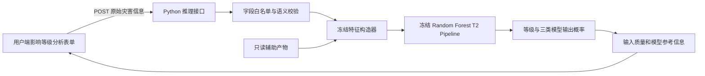

# 5.X 冻结模型的系统化部署

在完成三级分类模型的时间外评估与事后解释后，本研究进一步将已经冻结的 Random Forest T2 模型封装为灾害事件数字档案系统中的“影响等级辅助分析”模块。该阶段的目的不是继续追求测试指标，而是验证同一模型能否以可复现、可审计的方式从离线实验迁移到交互式系统。部署过程始终使用经过复现验证的原 Pipeline，不重新训练模型，不改变分类阈值、特征集合或超参数，也不把死亡人数、受影响人数、经济损失和事件结束信息等事后字段重新引入输入。

## 5.X.1 推理模块总体架构

系统采用同仓库的前后端分离推理结构。浏览器仅负责收集灾害发生时或发生前可获得的原始信息，Python Function 在服务端完成输入校验、冻结特征构造和模型推断。模型文件及 HDI、历史频率和 Magnitude 组统计等辅助产物均不发送至浏览器。

模型在服务端运行主要有三方面原因。第一，joblib 模型依赖 Python 科学计算环境，浏览器无法直接稳定加载；第二，服务端可以统一执行输入白名单、类别映射与缺失处理，避免前端实现与训练规则发生漂移；第三，模型结构和辅助统计量不暴露给客户端，减少模型文件被任意复制或篡改的风险。接口使用无状态请求，不默认保存用户输入和预测结果，也不依赖数据库写入。

## 5.X.2 输入信息与特征构造

用户不需要填写工程化特征。页面接收国家或地区代码、灾害类型、灾害子类型、发生日期、日期精度以及可选的 Magnitude 和量表。后端据此构造冻结模型需要的 15 项 T2 特征。

| 信息类别 | 原始输入或冻结来源 | 模型特征 |
|---|---|---|
| 空间与灾害类别 | ISO3、灾害类型、子类型及冻结映射 | country_code、region、disaster_type、disaster_subtype |
| 日期 | 发生日期与日期精度 | date_granularity、year、date_imputed、event_month、month_missing |
| 历史背景 | 截至固定日期的灾害档案时间区间 | historical_frequency |
| 社会经济背景 | 冻结年度 HDI 表 | hdi、hdi_missing |
| Magnitude | 原始值、量表及 Development 组统计 | magnitude_robust_z、magnitude_missing、magnitude_group_unknown |

日期构造保留原始精度。日精度事件使用真实年月日，月精度事件仅确定月份，年精度事件的月份保持缺失；系统不会把只有年份的记录伪装为 1 月 1 日。`date_imputed` 记录日期不完整状态，`month_missing` 明确表示月份不可用。

`historical_frequency` 延续数据准备阶段的保守因果定义：对同一国家，仅统计时间区间上界严格早于当前事件时间区间下界的既往事件。同日、同月、同年或可用日期区间相互重叠的事件不会互相计入，也不会通过虚构月日制造顺序。为了使同一输入在不同请求时间得到一致结果，推理模块使用截至固定日期的只读历史档案快照，而不是随在线数据库变化。

HDI 使用国家 ISO3 与事件年份精确查找。冻结表覆盖 1990—2023 年，不进行邻年补齐、插值或范围外外推；找不到对应年度值时保留缺失，并由原 Pipeline 内已经冻结的训练期缺失处理规则处理。对于冻结范围之后的年份，系统给出 HDI 缺失和历史档案截止提示，而不自行发明未来回退规则。

Magnitude 仅在已经冻结的同语义组内转换，其稳健标准化参数来自 Development 阶段的中位数与四分位距。有效组包括地震矩震级、风暴风速、洪水/野火面积以及三个温度子类型组；样本不足或四分位距为零的组不产生标准化值。`magnitude_robust_z` 只表示同灾害语义与同量表内的相对位置，不能用于跨灾害类型比较，更不能简单解释为“数值越大，死亡影响一定越严重”。

## 5.X.3 模型服务接口设计

推理服务提供健康检查、冻结选项和预测三个接口。预测接口仅允许 POST，请求体具有大小限制和明确字段白名单。国家代码未知、灾害类型与子类型组合无效、日期格式与精度不一致、Magnitude 非数值或有值却缺少量表时，接口返回稳定错误码与中文提示。服务器不会向普通用户返回文件路径、模型哈希、Python 堆栈或内部异常细节。

成功响应包括 Low、Moderate、Severe 三类输出概率、最终预测类别、输入质量状态、模型参考信息和固定免责声明。三类概率同时展示，避免只突出最高类别而形成确定性印象。本研究未对 Random Forest 输出进行概率校准，因此页面使用“模型输出概率”而非“置信度”或“真实发生概率”。该概率仅反映冻结模型在三类之间的相对输出强度。

模型参考信息采用透明且稳定的规则，根据本次实际输入说明灾害类型与地区、冻结历史频次、HDI 是否缺失、Magnitude 组是否适用以及日期是否完整。系统不在线运行 SHAP，也不把这些信息称为“贡献最大的因素”或因果解释。当 Magnitude 缺失时不展示相对位置；语义组未知时明确提示缺少组内标准化依据。

## 5.X.4 推理一致性验证

在接入前端之前，本研究先对冻结的 2022—2023 年 Test 集执行端到端一致性验证。验证区分“直接使用冻结工程特征调用 Pipeline”和“从原始字段经 API 特征构造器调用 Pipeline”两条路径。全部 948 条事件的预测类别均一致，一致率为 100%；重复执行中三类 `predict_proba` 的最大绝对误差不高于 3.33×10^-16，低于预设的 10^-12 容差，且没有任何概率值超过该误差阈值。输入列名、顺序和类别顺序 Low、Moderate、Severe 均完全一致，改变 JSON 字段顺序也不影响结果。

此外，接口自动化测试覆盖正常与最小输入、Magnitude 缺失、未知 Magnitude 组、HDI 缺失、日期粒度、未知国家、非法枚举、非法数值、空请求、概率和、重复请求确定性、结果字段拒绝和异常脱敏等情形。共 23 项合同与 HTTP 层测试全部通过。该结果说明系统化封装没有改变冻结模型行为，也没有引入重新拟合或测试后调参。

## 5.X.5 用户端交互设计

用户端新增“影响等级辅助分析”入口，并沿用原系统的 Hash Router、登录状态与 VAULT-0 黑底绿字视觉风格。表单通过冻结选项接口加载国家、灾害类型、子类型和量表，灾害子类型随类型联动，日期输入根据日、月、年精度改变格式提示。Magnitude 为可选项，页面同时解释其只能在相同灾害语义组内比较。

结果区域展示预测等级和三条横向概率条，Low、Moderate、Severe 始终同时出现。页面设置加载状态、输入错误提示、数据缺失提示、模型参考信息和固定免责声明。前端只传递原始白名单字段，HDI、历史频率与 Magnitude z 值全部由后端生成；死亡人数、受影响人数和经济损失既不显示为预测必填项，也不会进入请求体。

## 5.X.6 输入质量提示与结果解释

档案数据的覆盖边界会直接影响模型输入质量，因此接口把缺失状态作为响应合同的一部分。HDI 缺失时，页面说明模型使用训练阶段冻结的缺失处理；Magnitude 缺失时不展示其相对位置；量表或语义组不适用时，将其标记为未知组；年精度日期则提示月份缺失。对于训练期未出现但冻结档案可识别的新类别，后端按照原 One-Hot 编码器的未知类别规则处理并提示用户，不利用新请求扩充类别词表。

这种设计没有试图掩盖缺失信息，而是把数据适用范围与预测结果同时交付。由于参考信息没有采用在线局部 SHAP，页面不声称某个字段单独“导致”某一等级，也不会将 Magnitude 的相对标准分跨量表解释。

## 5.X.7 安全边界与用途限制

本模块的任务是对灾害事件最终死亡影响等级进行辅助分析，不是地震震级、台风等级或自然强度预测，更不是实时预警系统。模型训练数据来自历史档案，严重类别样本有限，外部环境和报告机制也可能随时间变化；冻结辅助数据在保障复现性的同时会带来时效性边界。因此，系统输出不能替代应急部门的专业判断，不能直接触发公共预警、资源调度或个体安全决策。

工程上，模型与辅助表只在服务端加载；接口同源优先，不开放任意来源跨域；请求体受大小和字段白名单限制；预测不默认写入数据库；敏感密钥和异常堆栈不返回前端。正式部署前还需在云端预览环境验证科学计算依赖的构建体积、冷启动、内存和运行时兼容性。本阶段仅完成本地一致性与构建验证，没有执行生产部署或数据库变更。

## 5.X.8 本节小结

本阶段建立了从原始灾害信息、冻结特征构造、服务端模型推断到用户端解释性展示的完整闭环。948 条时间外测试事件实现了类别 100% 一致，概率误差仅处于浮点末位；自动化接口测试与前端构建均通过。系统通过冻结辅助统计量、严格输入白名单和明确用途声明，在保持实验可复现性的同时控制了目标泄漏、规则漂移和结果误用风险，为毕业设计从离线模型实验过渡到可演示的信息系统功能提供了工程依据。
